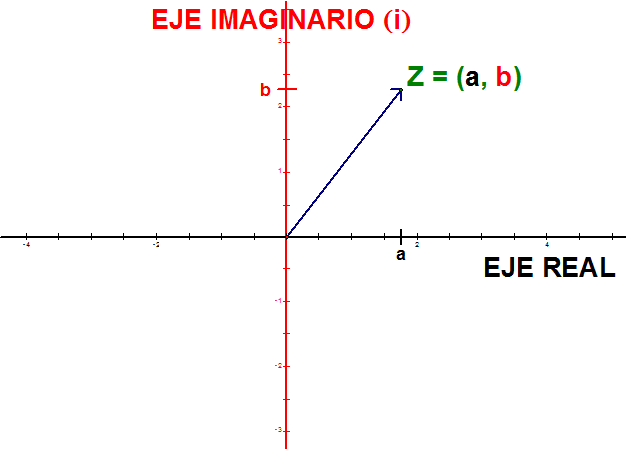
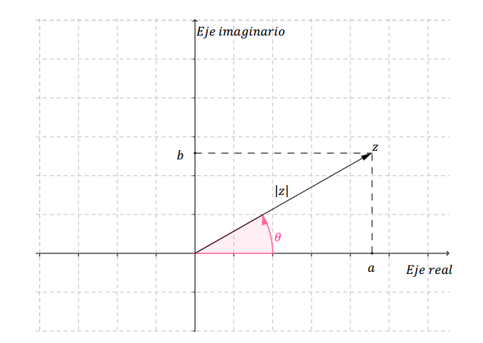

# PRACTICA-No.-7-FASORES
# Informe 

1. OBJETIVOS 

1.1. OBJETIVO GENERAL

- Emplear las operaciones basicas de la aritmetica con los numeros complejos y ver la diferencia de cuando realizamos calculos analiticos con los numeros reales

 1.2. OBJETIVO ESPECIFICO

- Analizar la forma rectancgular y polar de los numeros complejos
- Pasar de forma rectangular a polar y viceversa de forma analitica
- Comparar los calculos realizados detalladamente con los que nos arroja una calculadora cientifica

2. MARCO TEORICO

3. DIAGRAMAS

4. LISTA DE COMPONENTES

| CANTIDAD|MATERIAL O EQUIPO|
| ----- | ---- |
|1|Calculadora cientifica|

5. EXPLICACION 

- 7.5.1 Transforme a su forma polar

Anexos

-7.5.2. Transforme a su forma rectangular

Anexos

-7.5.3. Realice las siguientes operaciones paso a paso y represente el resultado tanto en su forma rectangular como en su forma polar.

Anexos

-7.5.4. Resuelva las operaciones anteriores por medio de la calculadora y compare resultados
7.5.1.

7.5.2.

7.5.3.

6. CONCLUCION

- Al momento de operar tienen un parecido a cuando operamos con vectores ya que aqui ya sea suma, resta, multiplicaion o division de lo debe hacer real con real e imaginario con imaginario
- Los resultados que nos da la calculadora son algo diferentes a los analiticos y esto se debe a que la calculadora usa un mayor numero de elementos a los que utilizamos nosotros

7. BIBLIOGRAFIA

- Floyd, T. (2007). PRINCIPIOS DE CIRCUITOS ELÉCTRICOS. (8va ed.). México, México: Pearson Education
